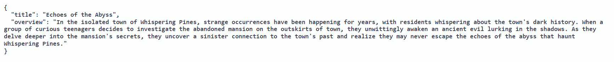

# Cinematic Genre Identifier

## Overview
The Cinematic Genre Identifier is a machine learning project that predicts/classifies the genre of a movie based on its title and plot. This project utilizes various machine learning models and deep learning architectures to achieve accurate genre classification.

## Project Structure
The project repository consists of the following files:

- **code.ipynb**: Contains preprocessing of data, visualization, handling class imbalance, and implementation of machine learning models such as Naive Bayes, Logistic Regression, Random Forest, and Multi-Layer Perceptron.
  
- **RNN_With_LSTM.ipynb**: Implements RNN with LSTM architecture for genre classification.

- **CNN.ipynb**: Implements Convolutional Neural Network (CNN) architecture for genre classification.

- **init.py**: Creates a FAST API to deploy and test the trained models.

- **helpers.py**: Contains code to preprocess input data for model consumption.

- **Project Report.pdf**: A research paper-style report documenting the project methodology, experiments, results, and conclusions.

## Model Deployment
The trained models and their associated vectorizers are saved using joblib after successful training. These saved models can be deployed using the provided FAST API. The API accepts inputs of movie titles and overviews and classifies the movies into one of the following genres: Action, Drama, Horror, Thriller, Comedy.

## Usage
To deploy the Naive Bayes models using the FAST API:
1. Ensure all required dependencies are installed.
2. Create a folder and place `init.py`, `helpers.py`, `Naive_Bayes.pkl` and `Naive_Bayes_Vectorizer.pkl`
3. Run `init.py` to start the FAST API.
4. Send requests to the API with movie titles and overviews in json format to classify the genres.

## Model Results

## Dependencies
The project requires the following dependencies:
- Python 3.11
- FastAPI
- joblib
- Matplotlib
- Sklearn
- Tensorflow
- Imbalanced-learn

## Citation
All Citations and credits are given in the `Project Report.pdf`(Project Report.pdf)

## License
This project is licensed under the MIT License - see the [LICENSE](LICENSE) file for details.
